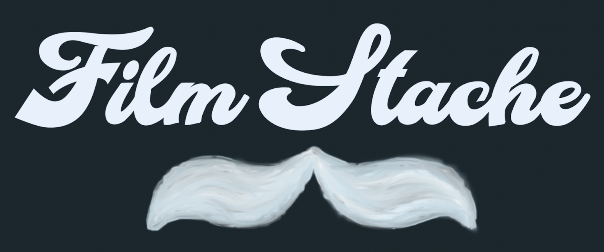

# FilmStache 

 

**Index** 
User Story 
Accessibility 
API's Used 
Contributors 
Demo 

**User Story** 
As a person that watches many movies, Im sure you are always looking for new ones to watch. But how do you remember each movie you have watched and if you would watch it again?  FilmStache is an application that allows you to Search. Watch. and Review. the movie that you have seen and cateogorizes it into your own personal library.  You will be able to search for those movies you watched and read the review you gave it to see if you want to watch it again.  

"FilmStache" allows each user to personalize their very own library with a quick signup process by using your email address and a password.
<!-- Insert Photo -->

Once you signup you can begin your search of a particular movie, or see the recommended movies that are loaded for you based off of user expereince. 
<!-- insert photo -->

After viewing the movie, you will click on the movie poster and write your reivew. 

After doing this, you can visit your personalized library and find the movies you have viewed and rated.  

<!-- Insert photo -->
 
The project represents the 2nd group project for the six contributors enrolled in the UNC Chapel Hill coding bootcamp fall of 2020.  The idea was had to create a database that a user code catalog the movies they have watched, and be able to revisit the reivews in which they personally wrote.  The page can be viewed here: 
<!-- insert hereko and github -->

**Accessibility**
The code includes semantic tags that help navigate through the webiste with ease. 

**API's Used**

**Contribuotors**

Thank you to the following people who contributed to this projectL  
[AlexNordin]
[BenjaminSmith]
[EllaThompson]
[GabrielRivera]
[GeorgetteBondarek]
[PatrickNarmi]
 

**Demo** 

